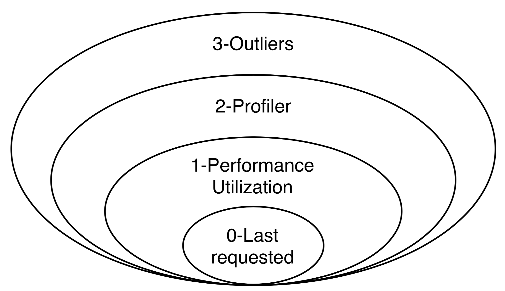

Detailed Functionality
======================
The functionality of the Dashboard is divided into two main components: data collection
and data visualization.
You can find detailed information about both components below.

1. Data Collection
-------------------
The amount of data collected by the Dashboard varies for each endpoint of the monitored
Flask application, depending on the monitoring level selected. To select the monitoring level
of your endpoints, you have to do the following (assuming you have successfully configured
the Dashboard as described in `the configuration page <configuration.html>`_):

1. Log into the Dashboard at: http://localhost:5000/dashboard/login

2. Go to the Overview tab in the left menu: http://localhost:5000/dashboard/overview

3. Select the endpoints that you want to monitor.

4. Select the desired monitoring level.

A summary of the monitoring levels is provided next. Note that every level keeps all the
features of the level below, in addition to bringing its own new features, as
represented in the diagram below.

Monitoring Level 0 - Disabled
~~~~~~~~~~~~~~~~~~~~~~~~~~~~~~~
When the monitoring level is set to 0, the Dashboard does not monitor anything about
the performance of the endpoint. The only data that is stored is when the endpoint is
last requested.

Monitoring Level 1 - Performance and Utilization Monitoring
~~~~~~~~~~~~~~~~~~~~~~~~~~~~~~~~~~~~~~~~~~~~~~~~~~~~~~~~~~~
When the monitoring level is set to 1, the Dashboard collects performance (as
in response time) and utilization information for every request coming to
that endpoint. The following data is recorded:

- **Duration:** the duration of processing that request.

- **Time_requested:** the timestamp of when the request is being made.

- **Version_requested:** the version of the Flask-application at the moment when the request arrived.
  This can either be retrieved via the `VERSION` value, or via the `GIT` value.
  If both are configured, the `GIT` value is used.

- **group_by:** An option to group the collected results.
  As most Flask applications have some kind of user management,
  this variable can be used to track the performance between different users.
  It is configured using the following command:

  .. code-block:: python

     def get_user_id():
         return 1234  # replace with a function to retrieve the id of the
                        # user within a request.

     dashboard.config.group_by = get_user_id
     # Note that the function itself is passed, not the result of the function.

  Thus, it becomes:

  .. code-block:: python

     from flask import Flask
     import flask_monitoringdashboard as dashboard

     app = Flask(__name__)
     dashboard.config.init_from(file='/<path to file>/config.cfg')

     def get_user_id():
         return '1234'  # replace with a function to retrieve the id of the
                        # user within a request.

     dashboard.config.group_by = get_user_id
     dashboard.bind(app)

     @app.route('/')
     def index():
         return 'Hello World!'

     if __name__ == '__main__':
         app.run(debug=True)

  The group_by-function must be a function that either returns a primitive (bool, bytes, float, int, str), or a function, or a tuple/list. Below is a list with a few valid examples:

  +---------------------------------------------------------------------------------------------+--------------------------------+
  | Code                                                                                        | Result                         |
  +=============================================================================================+================================+
  | dashboard.config.group_by = lambda: 3                                                       | 3                              |
  +---------------------------------------------------------------------------------------------+--------------------------------+
  | dashboard.config.group_by = lambda: ('User', 3)                                             | (User,3)                       |
  +---------------------------------------------------------------------------------------------+--------------------------------+
  | dashboard.config.group_by = lambda: lambda: 3                                               | 3                              |
  +---------------------------------------------------------------------------------------------+--------------------------------+
  | dashboard.config.group_by = ('User', lambda: 3)                                             | (User,3)                       |
  +---------------------------------------------------------------------------------------------+--------------------------------+
  | dashboard.config.group_by = lambda: 'username'                                              | username                       |
  +---------------------------------------------------------------------------------------------+--------------------------------+
  | dashboard.config.group_by = lambda: ['Username', 'username']                                | (Username,username)            |
  +---------------------------------------------------------------------------------------------+--------------------------------+
  | dashboard.config.group_by = lambda: [('User', lambda: 3), ('Username', lambda: 'username')] | ((User,3),(Username,username)) |
  +---------------------------------------------------------------------------------------------+--------------------------------+

- **IP:** The IP-address from which the request is made. The IP is retrieved by the following code:

.. code-block:: python

     from flask import request
     print(request.environ['REMOTE_ADDR'])

Monitoring Level 2 - Outliers
~~~~~~~~~~~~~~~~~~~~~~~~~~~~~~~~~~~~~~~~~~~~~~~~~~~~~~~~~~~
When the monitoring level is set to 2, the Dashboard collects extra information
about slow requests.

It is useful to investigate why certain requests take way longer to process than other requests.
If this is the case, a request is seen as an outlier.
Mathematically, a request is considered an outlier if its execution is a certain number of times longer than the
average duration for requests coming to the same endpoint:

:math:`duration_outlier > duration_average * constant`

Where :math:`duration_average` is the average execution time per endpoint, and :math:`constant` is given in the configuration
by OUTLIER_DETECTION_CONSTANT (its default value is :math:`2.5`).

When a request is an outlier, the Dashboard stores more information about it, such as:

- The stack-trace in which it got stuck.

- The percentage of the CPU's that are in use.

- The current amount of memory that is used.

- Request values.

- Request headers.

- Request environment.

The data that is collected from outliers, can be seen by the following procedure:

1. Go to the Dashboard Overview: http://localhost:5000/measurements/overview

2. Click the endpoint for which you want to see the Outlier information.

3. Go to the Outliers tab: http://localhost:5000/dashboard/endpoint/:endpoint_id:/outliers

Monitoring Level 3 - Profiler
~~~~~~~~~~~~~~~~~~~~~~~~~~~~~~~~~~~~~~~~~~~~~~~~~~~~~~~~~~~
When the monitoring level is set to 3, the Dashboard performs a
`statistical profiling <https://docs.python.org/3/library/profile.html#what-is-deterministic-profiling>`_
of all the requests coming to that endpoint. What this means is that another
thread will be launched in parallel with the one processing the request, it
will periodically sample the processing thread, and will analyze its current stack
trace. Using this information, the Dashboard will infer how long every function
call inside the endpoint code takes to execute.

The profiler is one of the most powerful features of the Dashboard, pointing to
where your optimization efforts should be directed, one level of abstraction
lower than the performance monitoring of Level 1. To access this information,
you have to:

1. Go to the Overview tab in the left menu: http://localhost:5000/dashboard/overview

2. Select an endpoint for which the monitoring level is or was at some point at least 2.

3. Go to the Profiler tab: http://localhost:5000/dashboard/endpoint/:endpoint_id:/profiler

4. Go to the Grouped Profiler tab: http://localhost:5000/dashboard/endpoint/:endpoint_id:/grouped-profiler

The Profiler tab shows all individual profiled requests of an endpoint
in the form of a execution tree. Each code line is displayed along with
its execution time and its share of the total execution time of the request.

The Grouped Profiler tab shows the merged execution of up to 100 most recent
profiled requests of an endpoint. This is displayed both as a table and as
a Sunburst graph. The table shows for each code line information about
the Hits (i.e. how many times it has been executed), average execution time
and standard deviation, and also total execution time.

2. Data Visualization
----------------------

The Dashboard shows the collected data by means of two levels of abstraction:
application-wide and endpoint-specific.

Application
~~~~~~~~~~~~~~
Visualizations showing aggregated data of all the endpoints (with monitoring level
at least 1) in the application can be found under the **Dashboard** menu:

1. **Overview:** A table with the all the endpoints that are being monitored (or have been monitored in the past).
   This table provides information about when the endpoint was last requested, how often it is requested and what is
   the current monitoring level. Each endpoint can be clicked to access the
   Endpoint-specific visualizations.

2. **Hourly API Utilization:** This graph provides information for each hour of the day of how often the endpoint is being requested. In
   this graph it is possible to detect popular hours during the day.

3. **Multi Version API Utilization**: This graph provides information about the distribution of the utilization of the requests per version.
   That is, how often (in percentages) is a certain endpoint requested in a certain version.

4. **Daily API Utilization:** This graph provides a row of information per day. In this graph, you can find
   whether the total number of requests grows over days.

5. **API Performance:** This graph provides a row of information per endpoint. In that row, you can find all the
   requests for that endpoint. This provides information whether certain endpoints perform better (in terms of
   execution time) than other endpoints.

6. **Reporting:** A more experimental feature which aims to automatically
   detect and report changes in performance for various intervals
   (e.g. today vs. yesterday, this week vs. last week, etc).

Endpoint
~~~~~~~~~~~~~~

For each endpoint in the Overview page, you can click on the endpoint to get more details.
This provides the following information (all information below is specific for a single endpoint):

1. **Hourly API Utilization:** The same hourly load as explained in (2) above, but this time it is focused on the data of that particular endpoint only.

2. **User-Focused Multi-Version Performance:** A circle plot with the average execution time per user per version. Thus, this graph consists of 3 dimensions (execution time, users, versions). A larger circle represents a higher execution time.

3. **IP-Focused Multi-Version Performance:** The same type of plot as 'User-Focused Multi-Version Performance', but now that users are replaced by IP-addresses.

4. **Per-Version Performance:** A horizontal box plot with the execution times for a specific version. This graph is equivalent to (4.), but now it is focused on the data of that particular endpoint only.

5. **Per-User Performance:** A horizontal box plot with the execution time per user. In this graph, it is possible to detect if there is a difference in the execution time between users.

6. **Profiler:** A tree with the execution path for all requests.

7. **Grouped Profiler:** A tree with the combined execution paths for all (<100) requests of this endpoint.

8. **Outliers:** The extra information collected on outlier requests.

Make it your own!
-----------------

Just as no two applications are the same, we understand that monitoring requirements
differ for every use case. While all the above visualizations are included by
default in the FMD and answer a wide range of questions posed by the typical web
application developer, you can also create your own custom visualizations tailored
to your needs.

You might wish to know how the number of unique users, the size of your
database, or the total number of endpoints have evolved over time. This is now
easy to visualize using FMD.

An example of a custom graph is shown below. FMD will execute :code:`on_the_minute()`
every minute at the second 01 and the graph will appear in the **Custom graphs** menu.

  .. code-block:: python

   def on_the_minute():
       print(f"On the minute: {datetime.datetime.now()}")
       return int(random() * 100 // 10)

   minute_schedule = {'second': 00}

   dashboard.add_graph("On Half Minute", on_the_minute, "cron", **minute_schedule)

Note the "cron" argument to the add graph.
Just like in the case of the unix cron utility you can use
more complex schedules. For example, if you want to collect
the data every day at midnight you would use:

  .. code-block:: python

   midnight_schedule = {'month':"*",
                        'day': "*",
                        'hour': 23,
                        'minute': 59,
                        'second': 00}

Besides cron, there's also the "interval" schedule type, which
is exemplified in the following snippet:

  .. code-block:: python

   def every_ten_seconds():
       print(f"every_ten_seconds!!! {datetime.datetime.now()}")
       return int(random() * 100 // 10)

   every_ten_seconds_schedule = {'seconds': 10}

   dashboard.add_graph("Every 10 Seconds", every_ten_seconds, "interval", **every_ten_seconds_schedule)

Note that not all fields in the :code:`schedule` dictionary
are required, only the non-zero / non-star ones.

Also, note that in the "cron" graph types you use singular names (e.g. second)
while in the "interval" you use plurals (e.g. seconds).

Finally, the implementation of the scheduler in the FMD
is based on the appscheduler.schedulers.Background schedulers
about which you can read more `in the corresponding documentation page <apscheduler.schedulers>`_.

Adding database cleaning schedule
----------------------------------

As your application grows, so will the amount of data stored in the database.
To prevent it from growing too large, you can set up a schedule to clean the database.
Pruning is fully customizable, and can be set up to run as often as you want deleting data as old as you want through
your own cron schedule.

This can be done by adding the following code to your application:

.. code-block:: python

    weeks_to_keep = 8
    delete_custom_graph_data = True
    pruning_cron_schedule = {'month':"*/2",
                            'day': 1,
                            'hour': 3,
                            'minute': 0,
                            'second': 0}

    dashboard.add_database_pruning_schedule(weeks_to_keep, delete_custom_graph_data, **pruning_cron_schedule)

The first argument is how many weeks of data you want to keep - in this case we delete data older than the last two months.
Second argument indicates whether you want to delete custom graph data as well.
The third argument is the cron schedule, which in the presented case will
clean the database every 2 months, on the first day of the month at 3:00 AM.

That's it! Now you won't have to worry about the performance slowing down with time.

Telemetry
----------------------

The Dashboard is setup to be able to collect telemetric-data. 
This data-collection can be toggled on and off under the "Configuration" route. 

The collected data is released weekly at https://flask-dashboard.github.io/fmd-telemetry. 

You can find detailed information about what and how data is collected below.

What:

1. **Number of endpoints:** The amount of endpoints, no names or anything that could expose your application.

2. **Number of blueprints:** The amount of blueprints, again - only the number.

3. **Aggregated monitoring levels:** To determine the most frequently utilized monitoring level, we aggregate the levels set from each endpoint.

4. **Version number:** In order to determine how often people update their dashboards, we collect the build number.

5. **Route visits:** Which routes you use in the dashboard.

How:

Anonymized data is sent to a remote server. This way we can monitor which functionalities are being used the most, and which functionalities are not being used at all. We are a small research team and this way we can focus our efforts on what actually matters.
This is most of the logic behind the telemetry:

.. code-block:: python

    def post_to_back_if_telemetry_enabled(class_name='Endpoints', **kwargs):
      """
      Function to send data to server, with dynamic IP fetching.
      If the IP cannot be fetched, the function will silently exit without sending data.
      """
      if telemetry_config.telemetry_consent or class_name == 'FollowUp':
         github_file_url = 'https://raw.githubusercontent.com/flask-dashboard/fmd-telemetry/master/ip_address'
         parse_server_ip = fetch_ip_from_github(github_file_url)
         if parse_server_ip is None:
               return  # Exit silently if no IP is fetched
         
         

         parse_server_endpoint = f'http://{parse_server_ip}/parse/classes/{class_name}'
         headers = telemetry_config.telemetry_headers
         data = {'fmd_id': telemetry_config.fmd_user, 'session': telemetry_config.telemetry_session}
         for key, value in kwargs.items():
               data[key] = value

         try:
               response = requests.post(parse_server_endpoint, json=data, headers=headers, timeout=1)
               return response
         except requests.exceptions.ConnectionError as e:
               return None

Need more information?
----------------------
Check out the `contact page <contact.html>`_ to see how you can get in touch with us.

